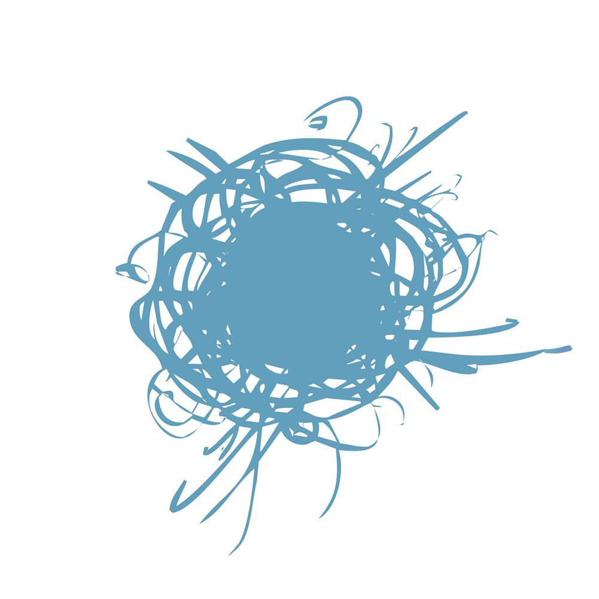

<h1>Grbisba Github Profile
    
</h1>

____

<h3>🛠 Most Used Languages</h3>

    <picture>
        <source
        srcset="https://github-readme-stats.vercel.app/api/top-langs/?username=grbisba&theme=vue-dark"
        media="(prefers-color-scheme: dark)"
        />
        <source
        srcset="https://github-readme-stats.vercel.app/api/top-langs/?username=grbisba&theme=vue"
        media="(prefers-color-scheme: light), (prefers-color-scheme: no-preference)"
        />
        
    </picture>

____

    <h3>📊 Github Stats</h3>
    <picture>
        <source
                srcset="https://github-readme-stats.vercel.app/api?username=grbisba&show_icons=true&theme=vue-dark"
                media="(prefers-color-scheme: dark)"
        />
        <source
                srcset="https://github-readme-stats.vercel.app/api?username=grbisba&show_icons=true&theme=vue"
                media="(prefers-color-scheme: light), (prefers-color-scheme: no-preference)"
        />
        
    </picture>

____

    <h3>📌 My Pinned Repository</h3>
    <a href="https://github.com/Grbisba/loggr">
        <picture>
            <source
                    srcset="https://github-readme-stats.vercel.app/api/pin/?username=grbisba&repo=loggr&theme=vue-dark&show_owner=true"
                    media="(prefers-color-scheme: dark)"
            />
            <source
                    srcset="https://github-readme-stats.vercel.app/api/pin/?username=grbisba&repo=loggr&theme=vue&show_owner=true"
                    media="(prefers-color-scheme: light), (prefers-color-scheme: no-preference)"
            />
            
        </picture>
    </a>
    <a href="https://github.com/Grbisba/hack-backend">
        <picture>
            <source
                    srcset="https://github-readme-stats.vercel.app/api/pin/?username=grbisba&repo=hack-backend&theme=vue-dark&show_owner=true"
                    media="(prefers-color-scheme: dark)"
            />
            <source
                    srcset="https://github-readme-stats.vercel.app/api/pin/?username=grbisba&repo=hack-backend&theme=vue&show_owner=true"
                    media="(prefers-color-scheme: light), (prefers-color-scheme: no-preference)"
            />
            
        </picture>
    </a>

____

<h3>📈 GitHub Activity Graph</h3>
    <picture>
        <source
                srcset="https://github-readme-activity-graph.vercel.app/graph?username=grbisba&radius=8&theme=vue"
                media="(prefers-color-scheme: dark)"
        />
        <source
                srcset="https://github-readme-activity-graph.vercel.app/graph?username=grbisba&radius=8&theme=github-light"
                media="(prefers-color-scheme: light), (prefers-color-scheme: no-preference)"
        />
        
    </picture>

____

<h3>🛠 Skills Stack</h3>

    
    
    
    
    
    
    
    
    
    
    
    
    
    

____

    <h3>📬 You can contact me</h3>
    
    

____

    <h3>
        💡 Advice of this day
    </h3>
    <h2>
    <em> rm ./ -r -f </em>
    </h2>

